Team: Julian Geppert (Matrikelnummer: 1195206), Benjamin Freukes (Matrikelnummer: 1287970)
Gültigkeitsdatum: 02.02.2020

# Aufbau der Dokumentation

- [Allgemeine Beschreibung der Lösung](#allgemeine-beschreibung-der-loesung)
- [Beschreibung der Komponenten des Servers](#beschreibungen-der-komponenten-des-servers)
    - Python Dateien
        - Zweck der Komponente
        - Methoden
        - Verbindungen zu anderen Dateien und Klassen
    - JavaScript Klassen/Dateien
        - Zweck der Komponente
        - Methoden
        - Verbindungen zu anderen Dateien und Klassen
- [CSS](#css)
- [Templates](#templates)
- [Konfiguration](#konfiguration)
- [Datenablage](#datenablage)

# Allgemeine Beschreibung der Loesung
Mit dieser Webseite erstellen wir eine Anwendung, welche es ermöglicht
ein Datenmanagement zu betreiben. Man kann Daten erfassen, bearbeiten, löschen und speichern.
Wenn Daten gelöscht werden wird dies durch ein Pop-up Fenster abgefragt.
Die Eingabe der "Mitarbeiter" Daten erfolgt durch eine Formularseite in der man den Namen, Vorname und spezifisch andere Daten 
eingeben kann. Außerdem gibt es auch einen zurück Button, welcher es ermöglicht von Bearbeiten zurück
zu gehen.

# Beschreibungen der Komponenten des Servers

## database.py:

- Zweck 
    - Diese Komponente ist es in die JSON Files zu schreiben und unsere ein gegebenen Daten abzuspeichern/löschen/überschreiben
- Methoden
    - init Werte werden initialisiert (data_o_Weiter,data_o_Zerti,data_o_Quali)
    - create_px prüft welche listForm die Aktuelle ist und erstellt dann 
    - read_px liest je nach listForm die Daten ein und gibt diese entsprechend zurück
    - update_px wird verwendet, um bestehende Daten zu bearbeiten und zu "überschreiben"
    - delete_px wird verwendet, um bestehende Daten zu löschen
    - getDefault_px setzt Default Werte ein für die Formulare
    - readData_p öffnet die JSON Dateien und speichert die Einträge in jeweilige Objekte
    - saveData_p speichert jeweils die Daten in den Jeweiligen JSON Dateien ab
- Verbindungen
    - Die Komponente ist mit Mitarbeiter.py Weiterbildung.py und der dataid.py in verbindung

## application.py
- Zweck 
    - Ist zuständig für das Erstellen der Dispatcher Klassen
- Verbindungen
    - Die Komponente ist mit Weiterbildung.py,Weiterbildunguebersicht.py,Mitarbeiteruebersicht.py,
    Mitarbeiterqualifikation.py,Mitarbeiter.py,Auswertungzertifikate.py,Auswertungweiterbildungen.py,
    Auswertungmitarbeiter.py , template.py und server.py in verbindung

## dataid.py

- Zweck 
    - Diese Komponente ist es eine uuid zu erstellen und zur verfügung zu stellen
- Methoden
    - create_px(self) generiert eine uuid
    - read_px(self) liest uuid ein und gibt diese zurück
    - readMaxId_p(self) liest die aktuelle MaxID wenn vorhanden sonst erstellen mit 0
    - saveMaxId_p(self) speicher die MaxID
- Verbindungen
    - Steht in Verbindung mit databse.py

## Mitarbeiter.py

- Zweck
    - Diese Komponente ist es sowohl Get,Put,Post als auch Delete Anfragen zu bearbeiten und bereit zu stellen
- Methoden
    - GET(self, mitarbeiter_id=None) holt eine oder mehrere Daten aus der Mitarbeiter.JSON 
    - POST(self) speichert Daten in Mitarbeiter
    - PUT(self, id_spa) bearbeitet bereits vorhandene Daten
    - DELETE(self, mitarbeiter_id) löscht anhand der ID bestimmte Daten
- Verbindungen
    - Steht in Verbindung mit database.py und der main.js

## Weiterbildung.py

- Zweck dieser Komponente ist es mit Get/Put/Post/Delete Weiterbildungen zu bekommen/bearbeiten/erstellen/löschen
- Diese können einzelne oder spezifisch durch Angabe einer ID geholt werden
- GET(self, weiterbildung_id=None) holen eine oder mehrerer Weiterbildungen
- POST(self) speichert Daten in Weiterbildungen
- PUT(self, id_spa) bearbeitet bereits vorhandene Daten
- DELETE(self, mitarbeiter_id) löscht anhand der ID bestimmte Daten
- Steht in verbindung mit der main.js, application.py 

## server.py
- Zweck
    - Zweck dieser Komponente ist es den Server zu Starten
    - Aktuelles Verzeichnis wird ermittelt um den richtigen Bezugspunkt zur server.conf zu setzen
    - Erster Eintrag geschieht bei Standerverhalten
    - Zweiter Eintrag Method-Dispatcher für die "Applikation" "app" vereinbaren
    - Steht in Verbindung mit der main.js und der index.html

## main.html
- Zweck
    - Metadaten werden gesetzt
    - JavaScript Dateien werden eingebunden
    - CSS wird eingebunden
    - Aside tag wird erstellt (Navigation)
    - Main tag wird erstellt (Main content der jeweiligen Seite)
    - Die Komponente steht in Verbindung mit den Folgenden Komponenten eve.js, main.js, req.js, tco.js, tmg.js und der Mitarbeiterqualifizierung.css

## main.js

- Zweck
  - Startseite_cl Klasse wird erstellt welche für den Content auf der Startseite zuständig ist
- Methoden
  - constructor (el_spl, template_spl) wird aufgerufen und 
  - async render_px (data_opl) holen der jeweiligen Daten und Aufruf von doRender mit den geholten Daten
  - async doRender_p (data_opl) erstellen der Webseite mit befüllten werten
- Verbindungen
  - steht in Verbindung mit der main.js, Mitarbeiter.py und Weiterbildung.py
- PfelgeMit_o
    - Zweck
      - PflegeMit_o Klasse wird erstellt welche für den Content auf der Pflegemit Seite zuständig ist
    - Methoden
      - constructor (el_spl, template_spl) wird aufgerufen und setzt das Template und ruft configHandleEvent auf
      - render_px (data_opl) holen der jeweiligen Daten und Aufruf von doRender mit den geholten Daten
      - async onClickDelete(event_opl) zuständig für das Löschen eines markierten Datensatz 
      - doRender_p (data_opl) erstellen der Webseite mit befüllten werten
    - Verbindungen
      - steht in Verbindung mit der main.js und der Mitarbeiter.py
- PflegeMitDetail_o
    - Zweck
      - PflegeMitDetail_o
    - Methoden
      - constructor (el_spl, template_spl) wird aufgerufen und setzt das Template und ruft configHandleEvent auf
      - render_px (data_opl) holen der jeweiligen Daten und Aufruf von doRender mit den geholten Daten
      - onClickDelete() zustänidg für das Löschen eines markierten Datensatz 
      - doRender_p (data_opl) erstellen der Webseite mit befüllten werten
    - Verbindungen
      - steht in Verbindung mit der main.js und der Mitarbeiter.py und der Funktion getTableID()
- MitarbeiterForm_o
    - Zweck  
      - MitarbeiterForm_o
    - Methoden
      - constructor (el_spl, template_spl) initialisiert werte 
      - render_px (data_opl) holen der jeweiligen Daten und Aufruf von doRender mit den geholten Daten
      - doRender_p (data_opl) erstellen der Webseite mit befüllten werten und ruft configHandleEvent_p auf
      - close_px () ruft exitHandler auf
      - exitHandler_p () zum Beenden eines Events
      - configHandleEvent_p () Event listener wird hinzugefügt reagiert auf ein Submit Event
      - handleSubmit_p (event_opl) zuständig um Dateien zu speichern unterscheidet, ob es ein neuer Datensatz ist oder ob ein alter bearbeitet wurde
      - async saveNewData_p (data_opl) ruft ein Post auf, um einen neuen Datensatz zu erstellen
      - async saveOldData_p (data_opl) ruft ein Put auf, um bereits vorhandene Datensätze zu bearbeiten
      - getFormData_px (form_opl) zuständig für das holen von Daten eines Forms
    - Verbindungen
      - steht in Verbindung mit der main.js und der Mitarbeiter.py und der Funktion getTableID()
- PflegeWeiter_o
    - Zweck
      - PflegeWeiter_o
    - Methoden
      - constructor (el_spl, template_spl) wird aufgerufen und setzt das Template und ruft configHandleEvent auf
      - render_px (data_opl) holen der jeweiligen Daten und aufruf von doRender mit den geholten Daten
      - async onClickDelete(event_opl) zustänidg für das Löschen eines markierten Datensatz 
      - doRender_p (data_opl) erstellen der Webseite mit befüllten werten
    - Verbindungen
      - steht in Verbindung mit der main.js und der Weiterbildung.py
- PflegeWeiterDetail_o
    - Zweck
      -PflegeWeiterDetail_o
    - Methoden
      - constructor (el_spl, template_spl) wird aufgerufen und setzt das Template und ruft configHandleEvent auf
      - render_px (data_opl) holen der jeweiligen Daten und aufruf von doRender mit den geholten Daten
      - onClickDelete() zustänidg für das Löschen eines markierten Datensatz 
      - doRender_p (data_opl) erstellen der Webseite mit befüllten werten
    Verbindungen
      - steht in Verbindung mit der main.js und der Weiterbildung.py und der Funktion getTableID()
- WeiterbildungForm_o
    - Zweck
      - WeiterbildungForm_o
    - Methoden
      - constructor (el_spl, template_spl) initalisiert werte 
      - render_px (data_opl) holen der jeweiligen Daten und Aufruf von doRender mit den geholten Daten
      - doRender_p (data_opl) erstellen der Webseite mit befüllten werten und ruft configHandleEvent_p auf
      - close_px () ruft exitHandler auf
      - exitHandler_p () zum Beenden eines Events
      - configHandleEvent_p () Event listener wird hinzugefügt reagiert auf ein Submit Event
      - handleSubmit_p (event_opl) zuständig um Dateien zu speichern unterscheidet, ob es ein neuer Datensatz ist oder ob ein alter bearbeitet wurde
      - async saveNewData_p (data_opl) ruft ein Post auf, um einen neuen Datensatz zu erstellen
      - async saveOldData_p (data_opl) ruft ein Put auf, um bereits vorhandene Datensätze zu bearbeiten
      - getFormData_px (form_opl) zuständig für das holen von Daten eines Forms
    - Verbindungen
      - steht in Verbindung mit der main.js und der Weiterbildung.py und der Funktion getTableID()
- SichtMit_o
    - Zweck
      - SichtMit_o
    - Methoden
      - constructor (el_spl, template_spl) wird aufgerufen und setzt das Template und ruft configHandleEvent auf
      - render_px (data_opl) holen der jeweiligen Daten und Aufruf von doRender mit den geholten Daten
      - async onClickDelete(event_opl) zuständig für das Löschen eines markierten Datensatz 
      - doRender_p (data_opl) erstellen der Webseite mit befüllten werten
    - Verbindungen
      - steht in Verbindung mit der main.js, der Weiterbildung.p, der Mitarbeiter.py und der Funktion getTableID()
- SichtMitForm_o
    - Zweck
      - SichtMitForm_o
    - Methoden
      - constructor (el_spl, template_spl) initialisiert werte 
      - render_px (data_opl) holen der jeweiligen Daten und Aufruf von doRender mit den geholten Daten
      - doRender_p (data_opl) erstellen der Webseite mit befüllten werten und ruft configHandleEvent_p auf
      - close_px () ruft exitHandler auf
      - exitHandler_p () zum Beenden eines Events
      - configHandleEvent_p () Event listener wird hinzugefügt reagiert auf ein Submit Event
      - handleSubmit_p (event_opl) zuständig um Dateien zu speichern unterscheidet, ob es ein neuer Datensatz ist oder ob ein alter bearbeitet wurde
      - async saveNewData_p (data_opl) ruft ein Post auf, um einen neuen Datensatz zu erstellen
      - async saveOldData_p (data_opl) ruft ein Put auf, um bereits vorhandene Datensätze zu bearbeiten
      - getFormData_px (form_opl) zuständig für das holen von Daten eines Forms
    - Verbindungen
      - steht in Verbindung mit der main.js der Mitarbeiter.py und der Funktion getTableID()
- SichtWeiter_o
    - Zweck
      - SichtWeiter_o
    - Methoden
      - constructor (el_spl, template_spl) wird aufgerufen und setzt das Template und ruft configHandleEvent auf
      - render_px (data_opl) holen der jeweiligen Daten und aufruf von doRender mit den geholten Daten
      - async onClickDelete(event_opl) zustänidg für das Löschen eines markierten Datensatz 
      - doRender_p (data_opl) erstellen der Webseite mit befüllten werten
    - Verbindungen
      - steht in Verbindung mit der main.js, der Weiterbildung.p, der Mitarbeiter.py und der Funktion getTableID()
- SichtWeiterForm_o
    - Zweck
      - SichtWeiterForm_o
    - Methoden
      - constructor (el_spl, template_spl) initalisiert werte 
      - render_px (data_opl) holen der jeweiligen Daten und aufruf von doRender mit den geholten Daten
      - doRender_p (data_opl) erstellen der Webseite mit befüllten werten und ruft configHandleEvent_p auf
      - close_px () ruft exitHandler auf
      - exitHandler_p () zum Beenden eines Events
      - configHandleEvent_p () Event listener wird hinzugefügt reagiert auf ein Submit Event
      - handleSubmit_p (event_opl) zuständig um Dateien zu speichern unterscheidet, ob es ein neuer Datensatz ist oder ob ein alter bearbeitet wurde
      - async saveNewData_p (data_opl) ruft ein Post auf, um einen neuen Datensatz zu erstellen
      - async saveOldData_p (data_opl) ruft ein Put auf, um bereits vorhandene Datensätze zu bearbeiten
      - getFormData_px (form_opl) zuständig für das holen von Daten eines Forms
    - Verbindungen
      - steht in Verbindung mit der main.js, der Weiterbildung.p, der Mitarbeiter.py und der Funktion getTableID()
- Mitarbeiter_o
    - Zweck
      - Mitarbeiter_o
    - Methoden 
      - constructor (el_spl, template_spl) wird aufgerufen und setzt das Template und ruft configHandleEvent auf
      - render_px (data_opl) holen der jeweiligen Daten und aufruf von doRender mit den geholten Daten
      - async onClickDelete(event_opl) zustänidg für das Löschen eines markierten Datensatz 
      - doRender_p (data_opl) erstellen der Webseite mit befüllten werten
    - Verbindungen
      - steht in Verbindung mit der main.js und der Mitarbeiter.py
- Weiterbildung_o
    - Zweck
      - Weiterbildungen_o
    - Methoden
      - constructor (el_spl, template_spl) wird aufgerufen und setzt das Template und ruft configHandleEvent auf
      - render_px (data_opl) holen der jeweiligen Daten und aufruf von doRender mit den geholten Daten
      - async onClickDelete(event_opl) zuständig für das Löschen eines markierten Datensatz 
      - doRender_p (data_opl) erstellen der Webseite mit befüllten werten
    - Verbindungen
      - steht in Verbindung mit der main.js und der Weiterbildung.p
- Zertifikate_o
    - Zweck
      - Zertifikate_o
    - Methoden
      - constructor (el_spl, template_spl) wird aufgerufen und setzt das Template und ruft configHandleEvent auf
      - render_px (data_opl) holen der jeweiligen Daten und Aufruf von doRender mit den geholten Daten
      - async onClickDelete(event_opl) zustänidg für das Löschen eines markierten Datensatz 
      - doRender_p (data_opl) erstellen der Webseite mit befüllten werten
    - Verbindungen
      - steht in Verbindung mit der main.js und der Weiterbildung.p
- SideBar_cl
    - Zweck
      - SideBar_cl
    - Methoden
      - constructor (el_spl, template_spl) wird aufgerufen und setzt das Template und ruft configHandleEvent auf
      - render_px (data_opl) holen der jeweiligen Daten und Aufruf von doRender mit den geholten Daten
      - configHandleEvent_p () öffnet ein Eventlistener der auf Clicks achtet und ruft dann handleEvent_p(event_opl) auf
      - handleEvent_p (event_opl) holt sich aktuelles Template und lädt dieses
    - Verbindungen
      - steht in Verbindung mit der main.js 
- Application_cl
    - Zweck
      - constructor() Erstellt Objekte von allen Klassen und verbindet diese mit den Templates
    - Methoden
      - notify_px (self, message_spl, data_opl) ist zuständig zum Laden der Templates
      - wählt mithilfe einer Switch Case aus welchem Template geladen werden muss
      - erstellt unsere Navigation
      - lädt zu Beginn die Startseite
      - close_px () ruft den exitHandler auf
      - exitHandler_p () ist für das Aufheben der Ereignisverarbeitung eines Formulares zuständig
      - configHandleEvent_p () ein EventListener welcher auf Clicks achtet 
      - handleEvent_p (event_opl) lädt aktuelle Seite anhand des Aktuellen Template
    - Verbindungen
      - steht in Verbindung mit allen klassen aus der main.js und allen *.py Dateien
- function addInput()
    - Zweck 
      - sorgt dafür, dass weitere Weiterbildungen hinzugefügt werden
- function select_Weiter(data)
    - Zweck
      - wird benötigt, um aus den Checkboxen die richtigen Weiterbildungen hinzuzufügen
- function stringifyFormData_px(formData_opl)
    - Zweck
      - wandelt die eingelesenen Daten in Strings um
- function getTableID(clicked_ID,form)
    - Zweck
      - Selektiert Eintrag aus einer Tabelle
      - speichert die ID des angeklickten Datensatzes
- function sortTable() / function sortTable2()
    - Zweck
      - wird zum Sortieren der Tabelle benutzt
    - Verbindungen
      - Die Komponente steht in Verbindung mit den folgenden Klassen: SideBar_cl,Zertifikate_o,Weiterbildung_o,Mitarbeiter_o,
        SichtWeiterForm_o,SichtWeiter_o,SichtMitForm_o,SichtMit_o,WeiterbildungForm_o,PflegeWeiterDetail_o,PflegeWeiter_o ,
        MitarbeiterForm_o, PflegeMitDetail_o,PflegeMit_o, Startseite_cl außerdem noch in mit der evs.js, req.js , tco.js, 
        tmg.js und der main.html
    
## req.js
- Zweck
    - Bearbeitet einfache Anforderungen per Fetch-API (Vorgabe Prof. Dr. Beims)
- Verbindungen
    - Steht in verbindung mit der main.js

## tco.js
- Zweck
    - Template-Engine: Compiler (Vorgabe Prof. Dr. Beims)
- Verbindungen
    - Steht in Verbindung mit evs.js, tco.js und der main.js

## tmg.js
- Zweck
    - Template Manager welcher Template Quellen lädt und bereitstellt (Vorgabe Prof. Dr. Beims)
- Verbindungen
    - Steht in Verbindung mit evs.js, tco.js und der main.js

## evs.js
- Zweck
    - Ist für den asynchronen Nachrichtenaustausch zuständig(Vorgabe von Prof. Dr. Beims)
    
# CSS 

## Mitarbeiterqualifizierung.css
- Zweck
    - Farbe geändert
    - Schriftgröße geändert
    - Breite und Höhe angepasst (margin, padding, lineheight,...)
    - Buttons haben transition bekommen beim Klicken so dass sich die Farbe ändert
    - Flexbox wurde für die oberste Zeile hinzugefügt
    - Unsortierte Liste wurde gestylt 
- Verbindungen
    - Steht in Verbindung mit der main.html

# Templates

## Pflege_Mit.mako

- Tabellen design wurde erstellt mit Gridbox
- Tabelle wurde mit Werten gefüllt
- Grundlegende Attribute (Name, Vorname, usw.) von Mitarbeitern werden angezeigt
- Möglichkeit zum Erfassen, Bearbeiten und Löschen von Einträgen hinzugefügt
- JavaScript wurde eingebunden
- Css wurde eingebunden
- Referenz zur switch Funktion wurde hinzugefügt mit der sich auf die Aufzählungsdarstellung wechseln lässt
- Steht in Verbindung zu der main.js

## Pflege_Mit_Detail.mako

- Tabellen design wurde erstellt mit Gridbox
- Tabelle wurde mit Werten gefüllt
- Detailliertere Ansicht von den Mitarbeitern, wo auch die Weiterbildung und die Zertifikate sowie Qualifikationen angezeigt werden
- Möglichkeit zum Erfassen, Bearbeiten und Löschen von Einträgen hinzugefügt
- JavaScript wurde eingebunden
- Css wurde eingebunden
- Referenz zur switch Funktion wurde hinzugefügt mit der sich auf die Aufzählungsdarstellung 
    wechseln lässt
- Steht in Verbindung zu der main.js

## Pflege_Weiter.mako

- Tabellen design wurde erstellt mit Gridbox
- Tabelle wurde mit Werten gefüllt
- Grundlegende Attribute (Bezeichnung, Beschreibung, usw.) von einer Weiterbildung werden angezeigt
- Möglichkeit zum Erfassen, Bearbeiten und Löschen eines Eintrages befinden sich hier
- JavaScript wurde eingebunden
- Css wurde eingebunden
- Referenz zur switch Funktion wurde hinzugefügt mit der sich auf die Aufzählungsdarstellung 
    wechseln lässt
- Steht in Verbindung zu der main.js
## Pflege_Weiter_Detail.mako

- Tabellen design wurde erstellt mit Gridbox
- Tabelle wurde mit Werten gefüllt
- Detailliertere Ansicht von einer Weiterbildung, wobei man diesmal auch das Zertifikat und die Qualifikation konfigurieren kann
- Möglichkeit zum Erfassen, Bearbeiten und Löschen eines Eintrages befinden sich hier
- JavaScript wurde eingebunden
- Css wurde eingebunden
- Referenz zur switch Funktion wurde hinzugefügt mit der sich auf die Aufzählungsdarstellung 
    wechseln lässt
- Steht in Verbindung zu der main.js

## Sichtweise_Mit.mako

- Tabellen design wurde erstellt mit Gridbox
- Tabelle wurde mit Werten gefüllt
- Anzeige von einem Namen eines Mitarbeiters und Weiterleitung zu einer Formularsicht
- JavaScript wurde eingebunden
- Css wurde eingebunden
- Referenz zur switch Funktion wurde hinzugefügt mit der sich auf die Aufzählungsdarstellung 
wechseln lässt
- Steht in Verbindung zu der main.js

## Sichtweise_Weiter.mako

- Tabellen design wurde erstellt mit Gridbox
- Tabelle wurde mit Werten gefüllt
- Anzeige von einem Namen einer Weiterbildung und Weiterleitung zu einer Formularsicht
- JavaScript wurde eingebunden
- Css wurde eingebunden
- Referenz zur switch Funktion wurde hinzugefügt mit der sich auf die Aufzählungsdarstellung 
wechseln lässt
- Steht in Verbindung zu der main.js

## Startseite.mako

- Tabellen design wurde erstellt mit Gridbox
- Tabelle wurde mit Werten gefüllt
- Anzeige von drei verschiedenen Anzahlen (Mitarbeiter, Weiterbildungen, Teilnahmen)
- JavaScript wurde eingebunden
- Css wurde eingebunden
- Referenz zur switch Funktion wurde hinzugefügt mit der sich auf die Aufzählungsdarstellung 
wechseln lässt
- Steht in Verbindung zu der main.js

## Mitarbeiter.mako

- Tabellen design wurde erstellt mit Gridbox
- Tabelle wurde mit Werten gefüllt und nach Nachnamen sortiert
- JavaScript wurde eingebunden
- Css wurde eingebunden
- Referenz zur switch Funktion wurde hinzugefügt mit der sich auf die Aufzählungsdarstellung 
wechseln lässt
- Steht in Verbindung zu der main.js
## Weiterbildungen.mako

- Tabellen design wurde erstellt mit Gridbox
- Tabelle wurde mit Werten gefüllt
- Anzeige einer Sortierten Tabelle von Weiterbildungen und dessen Teilnehmern
- Sortierung nach Bezeichnung Weiterbildung
- JavaScript wurde eingebunden
- Css wurde eingebunden
- Referenz zur switch Funktion wurde hinzugefügt mit der sich auf die Aufzählungsdarstellung 
wechseln lässt
- Steht in Verbindung zu der main.js

## Zertifikate.mako

- Tabellen design wurde erstellt mit Gridbox
- Tabelle wurde mit Werten gefüllt
- Anzeige einer Sortierten Tabelle von Zertifikaten
- Sortierung nach Namen der Mitarbeiter
- JavaScript wurde eingebunden
- Css wurde eingebunden
- Referenz zur switch Funktion wurde hinzugefügt mit der sich auf die Aufzählungsdarstellung 
wechseln lässt
- Steht in Verbindung zu der main.js

## Mitarbeiter_Form.mako

- Mit Inputs werden Daten geholt
- Tabelle wird mit dort angegebenen Werten gefüllt
- Formular zur Erfassung von Mitarbeiterdaten
- JavaScript wurde eingebunden
- Css wird eingebunden
- Referenz zur switch Funktion wurde hinzugefügt mit der sich auf die Aufzählungsdarstellung 
wechseln lässt
- Steht in Verbindung zu der main.js

## Sichtweise_Mit_Form.mako

- Mit Inputs werden Daten geholt
- Tabelle wird mit dort angegebenen Werten gefüllt
- Möglichkeit zur Anmeldung von Weiterbildungen
- Anzeige von angemeldeten Weiterbildungen
- Möglichkeit zur Stornierung einer Anmeldung
- JavaScript wurde eingebunden
- Css wird eingebunden
- Referenz zur switch Funktion wurde hinzugefügt mit der sich auf die Aufzählungsdarstellung 
wechseln lässt
- Steht in Verbindung zu der main.js

## Sichtweise_Weiter_Form.mako

- Mit Inputs werden Daten geholt
- Tabelle wird mit dort angegebenen Werten gefüllt
- Anzeige von Weiterbildungen bis ins Detail
- Möglichkeit den Status seiner Anmeldung zu ändern (nimmt teil, erfolgreich abgeschlossen, nicht erfolgreich abgeschlossen, usw.)
- JavaScript wurde eingebunden
- Css wird eingebunden
- Referenz zur switch Funktion wurde hinzugefügt mit der sich auf die Aufzählungsdarstellung 
wechseln lässt
- Steht in Verbindung zu der main.js

## Weiterbildungen_Form.mako

- Mit Inputs werden Daten geholt
- Tabelle wird mit dort angegebenen Werten gefüllt
- Möglichkeit Weiterbildungen und deren Qualifikationen sowie Zertifikate zu erfassen
- JavaScript wurde eingebunden
- Css wird eingebunden
- Referenz zur switch Funktion wurde hinzugefügt mit der sich auf die Aufzählungsdarstellung 
wechseln lässt
- Steht in Verbindung zu der main.js

# Konfiguration

- Konfiguration ist identisch mit dem des ersten Praktikum siehe static_config in der Server.py
- Steht in Verbindung zu server.py

# Datenablage

- Die Daten (Mitarbeiter, Qualifikation, Weiterbildungen, Zertifikate)  werden in unterschiedlichen JSON Dateien gespeichert(Mitarbeiter.json und Weiterbildung.json)

---

| 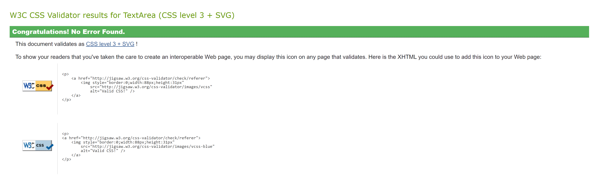 |
|:--:| 
| *css1* |

| 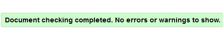 |
|:--:| 
| *Mitarbeiter Formular* |

| 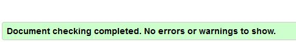 |
|:--:| 
| *Pflege Mitarbeiter* |

| 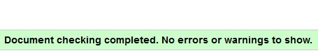 |
|:--:| 
| *Pflege Mitarbeiter Detail* |

| 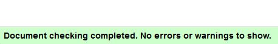 |
|:--:| 
| *Pflege Weiterbildung* |

| 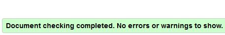 |
|:--:| 
| *Pflege Weiterbildung Detail* |

| 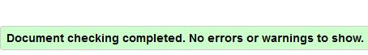 |
|:--:| 
| *Sichtweise Mitarbeiter* |

| 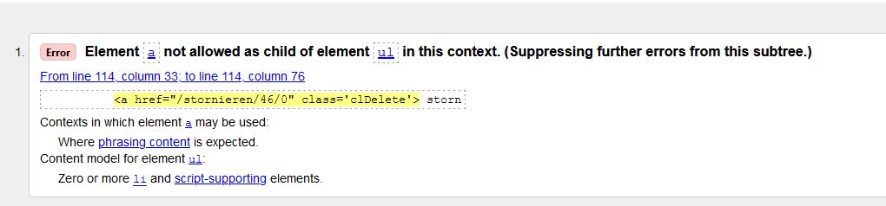 |
|:--:| 
| *Sichtweise Mitarbeiter Formular* |

| 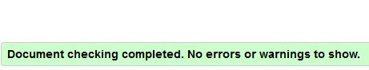 |
|:--:| 
| *Sichtweise Weiterbildung* |

| 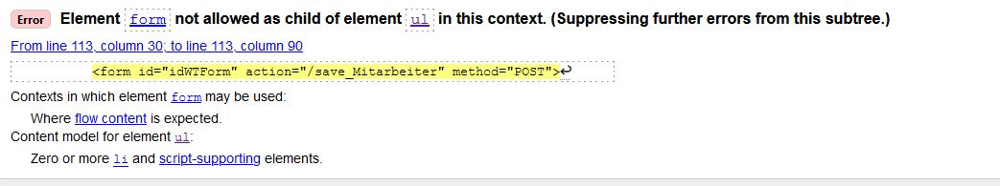 |
|:--:| 
| *Sichtweise Weiterbildung Formular* |

| 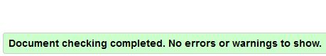 |
|:--:| 
| *Startseite* |

| 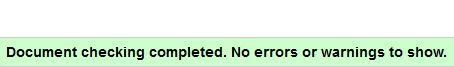 |
|:--:| 
| *Weiterbildung Formular* |

| 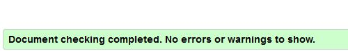 |
|:--:| 
| *Mitarbeiter* |

| 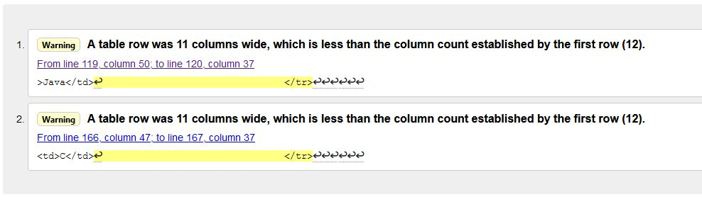 |
|:--:| 
| *Weiterbildungen* |

| 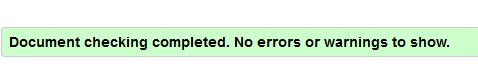 |
|:--:| 
| *Zertifikate* |

