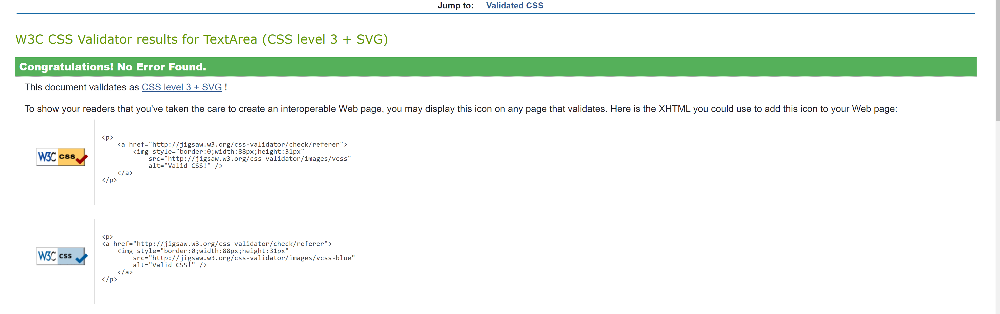

Team: Julian Geppert (Matrikelnummer: 1195206), Benjamin Freukes (Matrikelnummer: 1287970)
Gültigkeitsdatum: 17.12.2020

## Allgemeine Beschreibung der Lösung
Mit dieser Webseite erstellen wir eine Anwendung, welche es ermöglicht
ein Datenmanagement zu betreiben. Man kann Daten erfassen, bearbeiten, löschen und speichern.
Wenn Daten gelöscht werden wird dies durch ein Pop-up Fenster abgefragt.
Die Eingabe der "Mitarbeiter" Daten erfolgt durch eine Formularseite in der man den Namen, Vorname und spezifisch andere Daten 
eingeben kann. Außerdem gibt es auch einen zurück Button welcher es ermöglicht von Bearbeiten zurück
zu gehen.

###Beschreibungen der Komponenten des Servers
####application.py:
- Zweck dieser Komponente ist es Daten an die view.py weiter zu geben und die JSON Files zu schreiben/überschreiben/löschen
- switch Funktion welche den Parameter listForm an create_List_p übergibt und die aktuelle Form in 
self.listForm speichert
- init hat einen neuen self Wert listForm bekommen der die aktuelle Form speichert.
- add liefert den aktuellen Zustand von der Liste zu create_form_p
- delete Funktion welche einen Eintrag von der Tabelle löscht, ein Pop-up mithilfe von
Javascript erzeugt un einen Pfad zurück geht
- save bekommt jetzt den aktuellen Zustand von listForm mitgeliefert
- index liefert den Zustand von der Liste zu create_list_p
- edit liefert createForm_p(id_spl) zurück
- save_Mitarbeiter speichert einen Mitarbeiter in einem JSON Objekt ab, mit allen Attributen die dazu gehören
- save_Weiterbildung speichert eine Weiterbildung ab mit allen dazugehörigen Attributen
- stornieren entfernt einen Mitarbeiter von einer Weiterbildung
- createList_p wählt je nach Listenform die richtigen Daten raus und überträgt sie zur View.py
- createForm_p wählt je nach Listenform die richtigen Daten raus und überträgt sie zur View.py mit dem Zusatz das der Key noch mitgeliefert wird
####database.py:
- Zweck dieser Komponente ist es in die JSON Files zu schreiben und unsere ein gegebenen Daten abzuspeichern/löschen/überschreiben
- init Werte werden initialisiert (data_o_Weiter,data_o_Zerti,data_o_Quali)
- create_px prüft welche listForm die Aktuelle ist und erstellt dann 
- read_px liest je nach listForm die Daten ein und gibt diese entsprechend zurück
- update_px wird verwendet um bestehende Daten zu bearbeiten und zu "überschreiben"
- delete_px wird verwendet um bestehende Daten zu löschen
- storno_px entfernt einen Mitarbeiter von einer angemeldeten Weiterbildung
- getDefault_px setzt Default Werte ein für die Formulare
- readData_p öffnet die JSON Dateien und speichert die Einträge in jeweilige Objekte
- saveData_p speichert jeweils die Daten in den Jeweiligen JSON Dateien ab
####view.py
- Zweck dieser Komponente ist es immer das richtige template anzeigen zu lassen
- createList_px prüft welche listForm die Aktuelle ist und lädt jenachdem die html template Dateien.
- createForm_px prüft welche listForm die Aktuelle ist und lädt jenachdem das richtige Formular template.

####Pflege_Mit.tpl
- Tabellen design wurde erstellt mit Gridbox
- Tabelle wurde mit Werten gefüllt
- Grundlegende Attribute(Name, Vorname, usw.) von Mitarbeitern werden angezeigt
- Möglichkeit zum Erfassen, bearbeiten und löschen von Einträgen hinzugefügt
- JavaScript wurde eingebunden
- Css wurde eingebunden
- Referenz zur switch Funktion wurde hinzugefügt mit der sich auf die Aufzählungsdarstellung 
wechseln lässt

####Pflege_Mit_Detail.tpl
- Tabellen design wurde erstellt mit Gridbox
- Tabelle wurde mit Werten gefüllt
- Detailliertere Ansicht von dem Mitarbeitern, wo auch die Weiterbildung und die Zertifikate sowie Qualifikationen angezeigt werden
- Möglichkeit zum Erfassen, bearbeiten und löschen von Einträgen hinzugefügt
- JavaScript wurde eingebunden
- Css wurde eingebunden
- Referenz zur switch Funktion wurde hinzugefügt mit der sich auf die Aufzählungsdarstellung 
wechseln lässt
####Pflege_Weiter.tpl
- Tabellen design wurde erstellt mit Gridbox
- Tabelle wurde mit Werten gefüllt
- Grundlegende Attribute(Bezeichnung, Beschreibung, usw.) von einer Weiterbildung werden angezeigt
- Möglichkeit zum Erfassen, bearbeiten und löschen eines Eintrages befinden sich hier
- JavaScript wurde eingebunden
- Css wurde eingebunden
- Referenz zur switch Funktion wurde hinzugefügt mit der sich auf die Aufzählungsdarstellung 
wechseln lässt
####Pflege_Weiter_Detail.tpl
- Tabellen design wurde erstellt mit Gridbox
- Tabelle wurde mit Werten gefüllt
- Detailliertere Ansicht von einer Weiterbildung, wobei man diesmal auch das Zertifikat und die Qualifikation konfigurieren kann
- Möglichkeit zum Erfassen, bearbeiten und löschen eines Eintrages befinden sich hier
- JavaScript wurde eingebunden
- Css wurde eingebunden
- Referenz zur switch Funktion wurde hinzugefügt mit der sich auf die Aufzählungsdarstellung 
wechseln lässt
####Sichtweise_Mit.tpl
- Tabellen design wurde erstellt mit Gridbox
- Tabelle wurde mit Werten gefüllt
- Anzeige von einem Namen eines Mitarbeiters und Weiterleitung zu einer Formularsicht
- JavaScript wurde eingebunden
- Css wurde eingebunden
- Referenz zur switch Funktion wurde hinzugefügt mit der sich auf die Aufzählungsdarstellung 
wechseln lässt
####Sichtweise_Weiter.tpl
- Tabellen design wurde erstellt mit Gridbox
- Tabelle wurde mit Werten gefüllt
- Anzeige von einem Namen einer Weiterbildung und Weiterleitung zu einer Formularsicht
- JavaScript wurde eingebunden
- Css wurde eingebunden
- Referenz zur switch Funktion wurde hinzugefügt mit der sich auf die Aufzählungsdarstellung 
wechseln lässt
####Startseite.tpl
- Tabellen design wurde erstellt mit Gridbox
- Tabelle wurde mit Werten gefüllt
- Anzeige von drei verschiedenen Anzahlen(Mitarbeiter, Weiterbildungen, Teilnahmen)
- JavaScript wurde eingebunden
- Css wurde eingebunden
- Referenz zur switch Funktion wurde hinzugefügt mit der sich auf die Aufzählungsdarstellung 
wechseln lässt
####Mitarbeiter.tpl
- Tabellen design wurde erstellt mit Gridbox
- Tabelle wurde mit Werten gefüllt und nach Nachnamen sortiert
- JavaScript wurde eingebunden
- Css wurde eingebunden
- Referenz zur switch Funktion wurde hinzugefügt mit der sich auf die Aufzählungsdarstellung 
wechseln lässt
####Weiterbildungen.tpl
- Tabellen design wurde erstellt mit Gridbox
- Tabelle wurde mit Werten gefüllt
- Anzeige einer Sortierten Tabelle von Weiterbildungen und dessen Teilnehmern
- Sortierung nach Bezeichnung Weiterbildung
- JavaScript wurde eingebunden
- Css wurde eingebunden
- Referenz zur switch Funktion wurde hinzugefügt mit der sich auf die Aufzählungsdarstellung 
wechseln lässt
####Zertifikate.tpl
- Tabellen design wurde erstellt mit Gridbox
- Tabelle wurde mit Werten gefüllt
- Anzeige einer Sortierten Tabelle von Zertifikaten
- Sortierung nach Namen der Mitarbeiter
- JavaScript wurde eingebunden
- Css wurde eingebunden
- Referenz zur switch Funktion wurde hinzugefügt mit der sich auf die Aufzählungsdarstellung 
wechseln lässt
####Mitarbeiter_Form.tpl
- Mit Inputs werden Daten geholt
- Tabelle wird mit dort angegebenen Werten gefüllt
- Formular zur Erfassung von Mitarbeiterdaten
- JavaScript wurde eingebunden
- Css wird eingebunden
- Referenz zur switch Funktion wurde hinzugefügt mit der sich auf die Aufzählungsdarstellung 
wechseln lässt
####Sichtweise_Mit_Form.tpl
- Mit Inputs werden Daten geholt
- Tabelle wird mit dort angegebenen Werten gefüllt
- Möglichkeit zur Anmeldung von Weiterbildungen
- Anzeige von angemeldeten Weiterbildungen
- Möglichkeit zur Stornierung einer Anmeldung
- JavaScript wurde eingebunden
- Css wird eingebunden
- Referenz zur switch Funktion wurde hinzugefügt mit der sich auf die Aufzählungsdarstellung 
wechseln lässt
####Sichtweise_Weiter_Form.tpl
- Mit Inputs werden Daten geholt
- Tabelle wird mit dort angegebenen Werten gefüllt
- Anzeige von Weiterbildungen bis ins Detail
- Möglichkeit den Status seiner Anmeldung zu ändern(nimmt teil, erfolgreich abgeschlossen, nicht erfolgreich abgeschlossen, usw.)
- JavaScript wurde eingebunden
- Css wird eingebunden
- Referenz zur switch Funktion wurde hinzugefügt mit der sich auf die Aufzählungsdarstellung 
wechseln lässt
####Weiterbildungen_Form.tpl
- Mit Inputs werden Daten geholt
- Tabelle wird mit dort angegebenen Werten gefüllt
- Möglichkeit Weiterbildungen und deren Qualifikationen sowie Zertifikate zu erfassen
- JavaScript wurde eingebunden
- Css wird eingebunden
- Referenz zur switch Funktion wurde hinzugefügt mit der sich auf die Aufzählungsdarstellung 
wechseln lässt
####Mitarbeiterqualifizierung.css
- Farbe geändert
- Schriftgröße geändert
- Breite und Höhe angepasst(margin, padding, lineheight,...)
- Buttons haben transition bekommen beim Klicken so dass sich die Farbe ändert
- Flexbox wurde für die oberste Zeile hinzugefügt
- Unsortierte Liste wurde gestylt
####Mitarbeiterqualifizierung.js
- confirmDelete_p wird verwendet um das Pop up aufzurufen wenn man Sachen löschen möchte(Bestätigung)
- select_Weiter wird dazu verwendet eine Liste von Weiterbildungen bereitzustellen, für die man sich anmelden kann, dazu wird das Checkboxformat verwendet
- sortTable/2 benutzen wir um die Tabellen welche Sortiert sein sollen zu sortieren
###Datenablage
- Die Daten werden in unterschiedlichen JSON Dateien gespeichert(Mitarbeiter, Qualifikation, Weiterbildungen, Zertifikate) 

---

